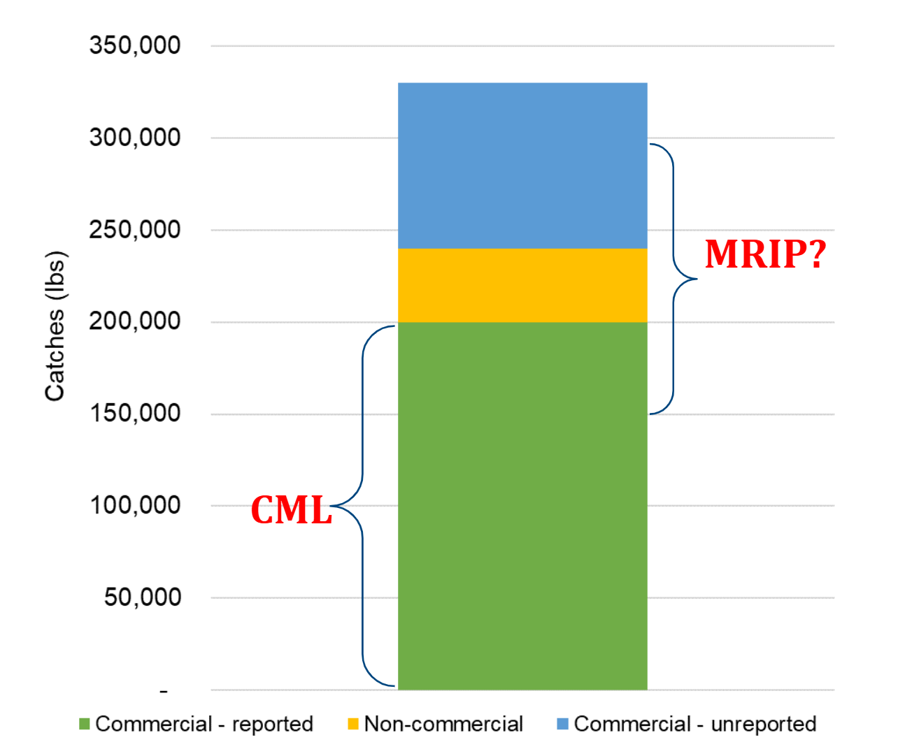
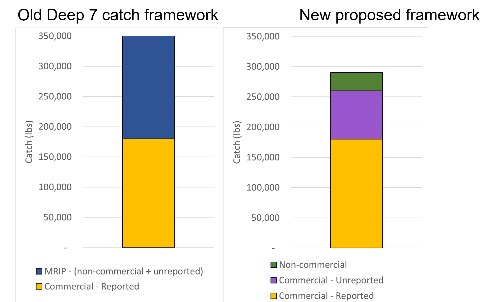

::: {.callout-tip icon=false}
## TLDR:

*   We can use the BFVR to get an approximate number of non-commercial fishing boats in Hawaii each year
*   We can use the FRS database to get an estimate of how much non-commercial type fishers catch per trip
*   Combining these can give us an estimate of yearly non-commercial catch in Hawaii
*   This approach is an improvement from previous methods but there is still work to be done to validate the BFVR and get more insight into fisher behaviors and motivations
:::

# Background  

*   Coastal fisheries in Hawaii can be divided into commercial and non-commercial components based on the possession of a Commercial Marine License (CML).
CML holders, which defines the commercial sector, are required to self-report their catch, including those kept for themselves or given away, with some unknown amount unreported.

*   Starting in the early 2000s, PIFSC has been relying on HMRFS/MRIP estimates to obtain non-commercial catches, with the assumption that these also covered some of the unreported commercial catches, while also overlapping with CML catches to some extent (Fig. 1).  

*    Fishers have been arguing for many years that the MRIP Deep 7 catch estimates are unrealistic and advocated for a different approach.

*   In addition, PIFSC stock assessment scientists have been dealing with the high variability associated with the MRIP estimates, often relying on a fixed CML-to-MRIP catch ratio or moving averages.  

*   In 2024, DAR proposed an alternative focused on using the number of boats registered in the Bottomfish Vessel Registration (BFVR) to obtain non-commercial catch.
A BFVR registration is required by law for anyone catching a Deep 7 in Hawaii, regardless of commercial or non-commercial status.  

*   One major advantage of this approach is that it clearly splits the Deep 7 catches into its three components (commercial - reported, commercial - unreported, and non-commercial catches), and allows us to deal with their associated weaknesses individually (Fig. 2).  

*   Following this proposal, NOAA and DAR worked together to formalize this approach and started a series of meetings with fishers, held in March and June 2025.  

*   These meetings were to present the new framework, introduce the new non-commercial BFVR approach, discuss the 3 major assumptions associated with it, and start the discussion on unreported commercial catch using an interactive analysis tool.  

# Summary of the BFVR approach to non-commercial catch

The approach consists of:
*   Obtaining, on an annual basis, the number of boats on the BFVR that are not associated with a CML (i.e., the number of non-commercial boats).  

*   Modifying this number to remove the boats that are on the list but not actively fishing for Deep 7 (assumption #1).  

*   Modifying this number to add boats that are not on the list but are actively fishing for Deep 7 (assumption #2).  

*   The above steps then produce the number of active non-commercial Deep 7 boats.
The next step is to use the FRS commercial catch database, select “non-commercial” fisher proxies from it, and calculate their annual Deep 7 catch as an estimate of non-commercial Deep 7 catch per boat.  

*   To remove high-liners and other fishers that are not suitable proxies for non-commercial fishers, a maximum lbs/trip of Deep 7 needs to be established (assumption #3).  

*   Non-commercial catch in a given year can then be obtained by multiplying the # of active non-commercial boats by the non-commercial annual Deep 7 catch per boat.  

# Fisher meetings results  

*   Fishers were generally positive about the new framework for Deep 7 catches and about moving away from relying on HMFRS/MRIP for catch estimation.  

*   The new non-commercial Deep 7 catch estimates, which represented only a small fraction of the commercial catch, were deemed more realistic than the previous MRIP-based estimates.  

*   Regarding the 3 major assumptions used in the BFVR non-commercial catch approach, an informal polling of fishers at the 2nd meeting generated the following results:
    *   What percent of BFVR non-commercial fishers are actively fishing for Deep 7? **8 responses; mean: 67%, range: 40-90%**  
    *   What percent of active Deep 7 fishers are not on the BFVR? **8 responses; mean: 48%, range: 30-80%** (note: excluded a 0% response, which is likely a mistake).
    *   What should be the lbs/trip filter for non-commercial fishers? The options available were 50, 70, and 100 lbs/trip. Some fishers thought 100 lbs/trip was too high (Layne, Eddie), while others argued that 50 lbs/trip was too low (Nathan).  

*   The discussion on the level of unreported commercial catch was limited due to time constraints.  

*   At the end of the second meeting, fishers were asked how they felt about this new catch framework and approach to non-commercial catch. They felt using the BFVR was the way forward, and that the proposed approach can be further improved by surveying fishers on the BFVR list directly (email, mail, etc.). They stressed the importance of more outreach and enforcement checks regarding registrations to the BFVR (even for kayak fishers and others). Furthermore, they also acknowledged that unreported commercial catch is the bigger issue (vs. non-commercial catch) and needs to be the focus of future efforts (investigate social media sales, etc.). The uku mail survey may inform the way forward for the Deep 7. They appreciated the use of the Shiny app to understand the implications of the different assumptions that go into the BFVR approach.  

# Next steps

## Short-term

*   Write a report formalizing the BFVR approach, extending the report from J. Helyer with the work that has been done since then.  

*   Informal email survey of the non-commercial BFVR, asking simple questions (“Did you fish for Deep 7 in the last year?”, “About how much Deep 7 do you catch in a typical year?”).  

*   Start work on unreported commercial catch.

## Long-term

*   Implement a mail catch survey of the BFVR, using lessons from the uku mail survey.
Ask DOCARE to do checks on BFVR compliance.  

*   Conduct outreach (e.g., fishing tournaments) to inform fishers about the BFVR.
Modify the BFVR renewal email to add information about the BFVR (the list of species, the legal requirement to be on it to catch Deep7, etc.).  

*   Send a letter every few years to all boats registered on the DOBOR list (that can be used for fishing), informing them about the need to also register for the BFVR (if fishing for Deep7).
 