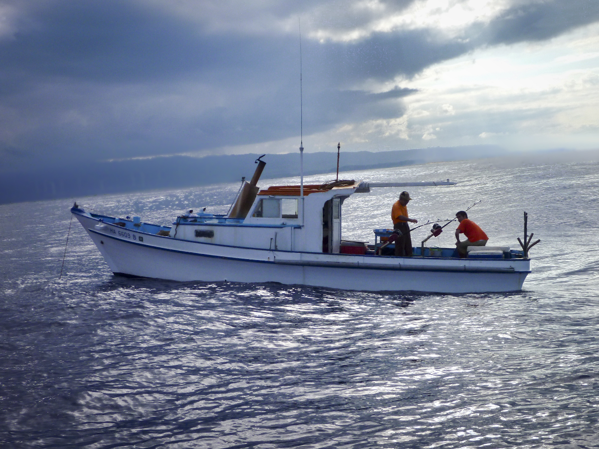
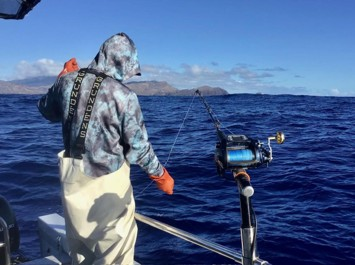

{fig-align="center"}

::::{.cr-section layout="sidebar-right"}

@cr-what

:::{#cr-what .large-fixed-text}
The Deep 7 Research Track is
:::

:::{.progress-block}
a chance for NOAA scientists to step back from urgent deadlines and take a deeper dive into how we **study and protect** Hawaii's most valuable bottom fish

**free from the pressure** of immediate management decisions

a **partnership** where **your knowledge** as fishers combines with our scientific tools to create better understanding.
:::

::::

# We're exploring key questions that matter to you  

The research priorities below came directly from conversations with fishers like you. Over the next few years, we're tackling the issues you've told us need attention:  

::::{.cr-section layout="sidebar-left"}

:::{.progress-block}
Getting **better estimates** on non-commercial fishing and understanding how the non-commercial fishery really works.  @cr-myimage

Learning more about fish life cycles and sizes by **partnering** with fishers who can help us collect data from their catches.

Making our research surveys more effective by testing **new fishing methods** and **expanding** where we sample. 

Taking a **fresh look** at how we group the Deep 7 species and whether there are better ways to study them together.  

And **much more** based on what we learn!
:::

:::{#cr-myimage}

:::
::::

# How can I get involved?  

::::{.cr-section layout="sidebar-right"}

:::{.progress-block}
We're holding regular community meetings where you can see our latest findings and share your thoughts. @cr-bfish

Missed a meeting? You can catch up on what we've discussed by checking out our [previous meeting notes](./assets/meeting_notes.qmd). @cr-bfish  

Have questions or ideas? We want to hear from you! Drop us a line at [felipe.carvalho@noaa.gov](mailto:felipe.carvalho@noaa.gov?subject=Deep7%20Research%20Track). @cr-bfish

:::

:::{#cr-bfish}

:::
::::

  
